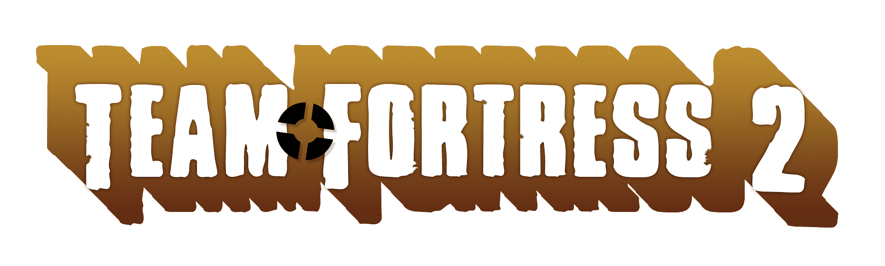

 

 
 

Team Fortress 2 Sentry (Level 1).

3D print your own and upgrade it!

 

# About

 

I started this project about in February, 2025, after Valve announced open-sourcing Team Fortress 2.

TF2 was (and will be) my favourite shooter, I grew up with it, and I love it. 

It always had place in my heart. So here I am, to commit something to the community, I made this project
which includes self-made 3D CADs and some electronics. 

This took hundrets of hours to make, and spanned over 4 whole months to make.

 

**Feel free to do whatever you want with it!**

 

## Parts

 

Microcontroller: `ESP32`

I'm using some standard servos and motors, as well as LEDs etc. 

All (electronic) parts can be purchased at [botland.com.pl](https://www.botland.com/pl).

Everything (that could be) is 3D-printed. I made all models myself.
All models should be in `parts/` directory.

For any additional info and contribution, please contanct me at `switalamaciej5@gmail.com` or github.

 

# Gallery

 

 

 

## Functionality & code

 

This project's goal was to create a 3D replica of Sentry from our beloved game Team Fortress 2.
Code for this Sentry (and wireless module (Wrangler), which is not finished) isn't ready or good, 
I would say it is trash and was assembled quickly just to test the turret. Feel free to make/submit
your own code for this project, you can use current one as reference. 

 

## Build

 

For building and deploying I use(d) **Visual Studio Code** plugin [Platformio](https://platformio.org/).

 

---

 

    

 

---

 

## Notice

 

Inspired by [Mr. Volt](https://www.youtube.com/@MrVolt).

This project is not affiliated with Valve Corporation.
Images sources:
- [teamfortress.com](https://www.teamfortress.com)
- [mundymundy.tumblr.com](https://mundymundy.tumblr.com/post/672858009940213760/hello-can-you-do-general-relationship-headcanons)
